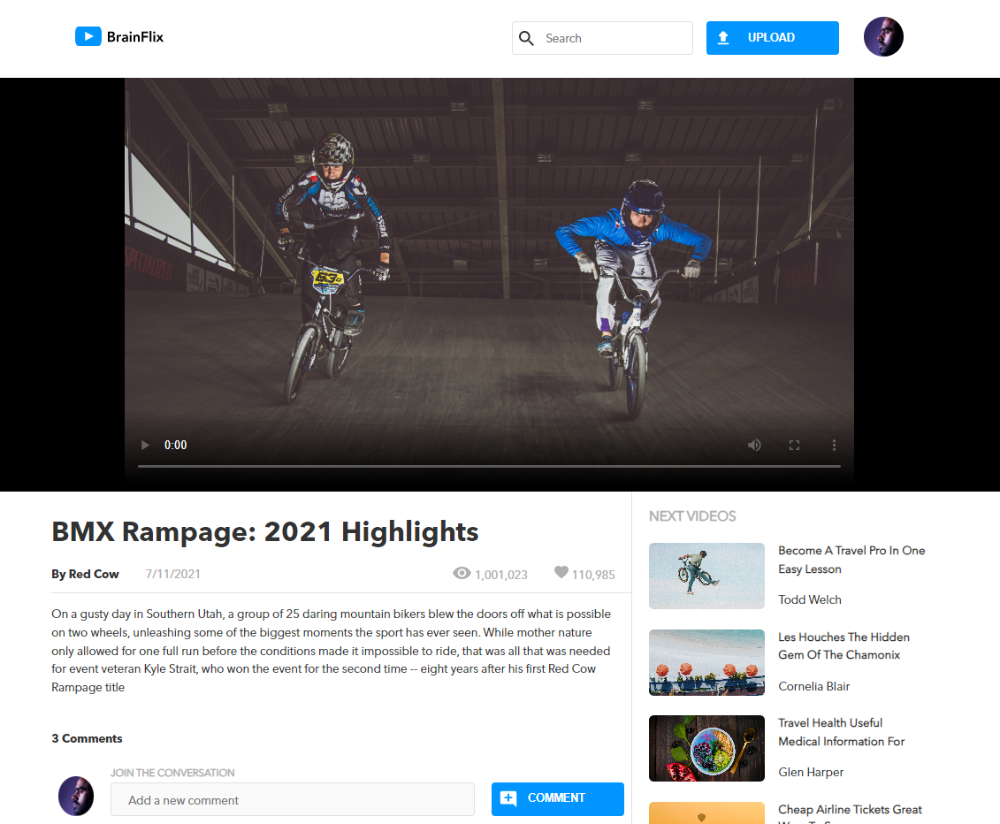

# Brainflix (Bootcamp Project)

## React, Custom API, Sass Responsive Design

Bootcamp project to build a YouTube-like web application with videos and comments.

> ### Features
>
> - Adding and deleting comments via POST and DELETE requests
> - Uploading thumbnail images for new videos
> - express.js backend with custom API

<br>



<br><br>

## Functional Requirements

#### API Server

---

- The end-points and response structure of your API server must match that of the mock API server.
- The API must have the following end-points:
  - GET /videos that responds with an array of videos.
  - GET /videos/:id that responds with an object containing the details and comments for a video an id of :id.
  - POST /videos that will add a new video to the video list. A unique id must be generated for each video added.
- Submitting a new video from the form must POST to the API.
- Images should be served as static assets from the Node server.
  - Including the image used for creating a new video via Upload Form
- The data should persist on the server. If you restart Node server, the data shouldn't reset. This means you need to use a JSON file for persistence, writing to it, and reading from it.
- You should have a single source of truth for your data. Only one JSON file should be used to store all the data on your server.
  - Since you are now creating your own REST API, you now have to think about how you will use your one data file to mimic the API response from Sprint 2. One endpoint will return a small amount of data for each video that exists, the second endpoint will return all the data for one specific video. Think about how you may use your data file to achieve this within your project.

<br><br>


<br><br>

#### Video Upload Page

---

- With the "Video Upload" page now created, add the actual upload functionality. Specifically, this should include an event handler for the upload form so that when a user submits a new video, it posts the video to your API in order to save it to the list of videos. A new video needs to be persisted in a JSON file with the app data.

<br><br>

<br><br>

#### Visual Design Requirements

---

- The site must be responsive at and between breakpoints. Therefore it should closely resemble the mockups in the design package.

### Implementation Requirements

---

- The site must make use of the provided assets.
- The app must use multiple React components as discussed in class.
- The app must use react-router-dom with multiple routes, one for each page.
- The project's CSS must use SASS variables.
- The CSS must use BEM principles when naming classes.
- The site should use Flexbox for layout control.

<br><br>

## Setup

1. Clone this repository.
2. In the terminal, run the following command to install dependencies

```sh
npm i
```

3. Run the app on your local server

```sh
npm start
```

<br><br>

## Backend API

The API repository can be accessed [here](https://github.com/gtiku/giyona-tiku-brainflix-api).
